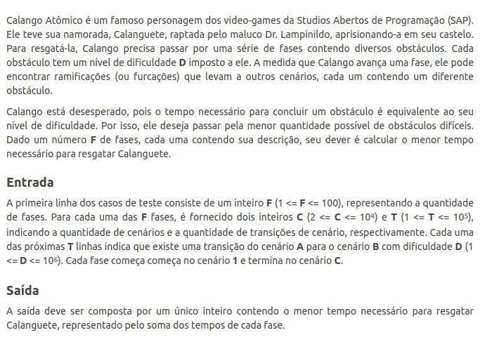
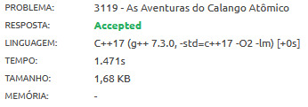
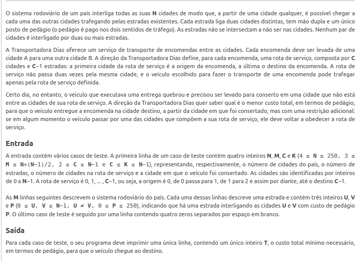
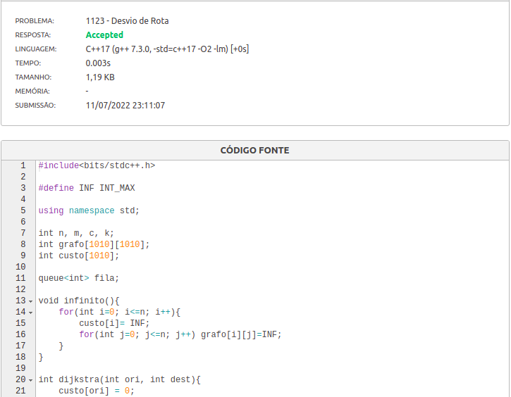
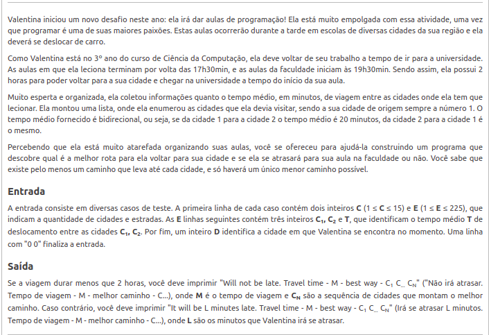
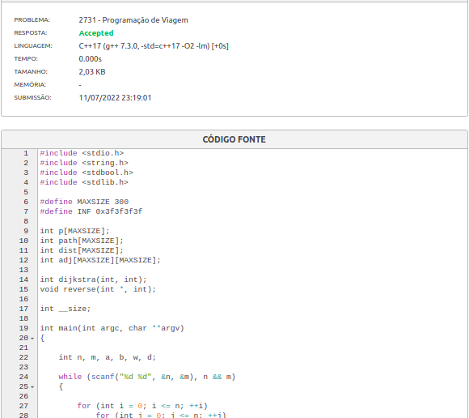

Problemas do beecrowd (plataforma de exercícios)

**Conteúdo da Disciplina**: Tema: Grafos2 

## Alunos
|Matrícula | Aluno |
| -- | -- |
| 180149598  |  Victor Hugo SIqueira Costa |
| 180029240  |  Wesley Pedrosa dos Santos |

## Sobre 
Repositório contendo solução dos exercícios da plataforma *beecrowd* envolvendo Grafos2 (problemas que envolvam Grafos com pesos nas arestas). CAda arquivo 'cpp' corresponde a um problema em específico.

## Screenshots

As aventuras do Calango Atômico 
 
 

Desvio de Rota 
 
 

Programação de Viagem 
 
 

## Instalação e Uso
**Linguagem**: C++ 
Bastar acessar o link de cada um dos problemas e copiar/colar depois executar o código respectivo ao problema para conseguir o *accepted*

